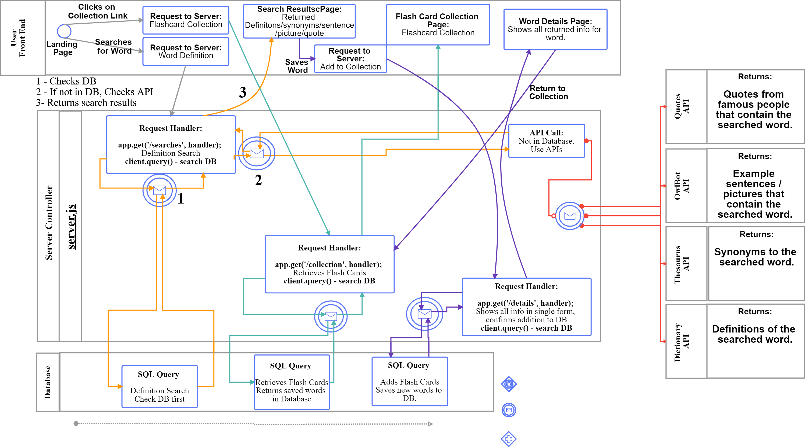
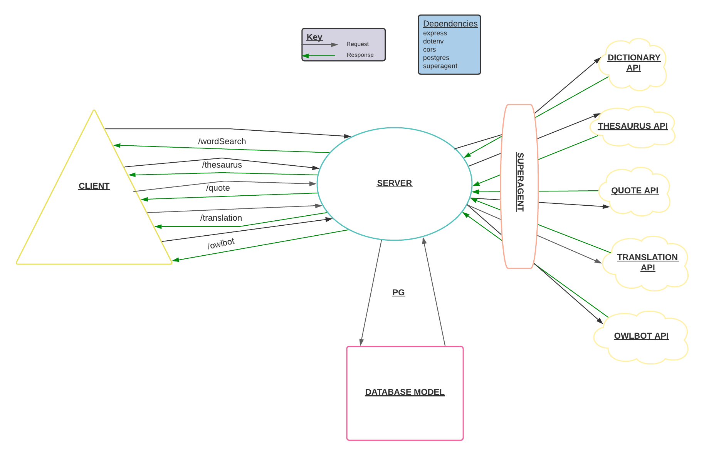

# LEXICApp

### *An app allowing for English language definition and review. Users may search definitions for words, while being provided proper pronunciations, use in a sentence, the word used in a quote by a famous individual, and a picture of the activity or item, if available.*

+ **MVP -** At the very least, we want to save searched words into a database and have corresponding flash cards to quiz the user on demand. 
Then incorporate a translation API to teach that word in other languages. 
  + We will also utilize a quote generator API to bring in quotes that contain the searched word. 
  + We will also use an Owlbot API to generate photos for the searched word.
  + Stretch goals - 
  + Point system tied to an individual user - the more you quiz and succeed the more points you get! 
  + Leader board to go with the point system?
  + Flip animations for the flash-cards
  + Responsive Web Design for phone-laptop-tablet usability 
  + Incorporate audio files into the flashcard so you can HEAR how to properly pronounce the word too!
  + Google translate link somewhere /Google translate API 
  + Functionality to edit the flashcard to incorporate your preferred acronym/synonym etc.

## **User Stories**

1. ## Basic User
As a User, I would like to enter a word and be given the definition

### Feature Tasks
Landing page section with input form and submit button

### Acceptance Tests
**GIVEN:** User search query 
**THEN:** display API results for query
**WHEN:** User clicks submit

2. ## Student User
As a User, I would like to save my search queries as flashcards for future study

### Feature Tasks
Database storage to retrieve saved words via flashcards

### Acceptance Tests
**GIVEN:** a User wants to review past words
**THEN:** allow user to browse saved words in database
**WHEN:** User clicks ‘saved words’  link

3. ## Second Language User
As a User, I want to be able to translate the english word into other languages 

### Feature Tasks
Results page has a “translate” form where you can select preferred language

### Acceptance Tests
**GIVEN:** User search query
**THEN:**  access a translation API 
**WHEN:** until User clicks ‘translate’ button in API results display

4. ## Specific Needs User
As a User, I want to edit the response data to get more info specific to my interests

### Feature Tasks
Results page will have some type of ‘edit’ button

### Acceptance Tests
**GIVEN:** API response/results
**THEN:**  ability to edit the response page to render more from the APIs?
**WHEN:** User clicks ‘edit’ button on results page

5. ## Recurring User
As a User, I want to see my previous flashcards in the database to constantly review my new vocab

### Feature Tasks
Use database storage to store search results for as long as a User’s profile exists

### Acceptance Tests
**GIVEN:** User saves search query
**THEN:**  They will have access to all previously generated search results in database
**WHEN:** User clicks “my flashcards”

## **Domain Model**

## **Entity Relationship Diagram**

